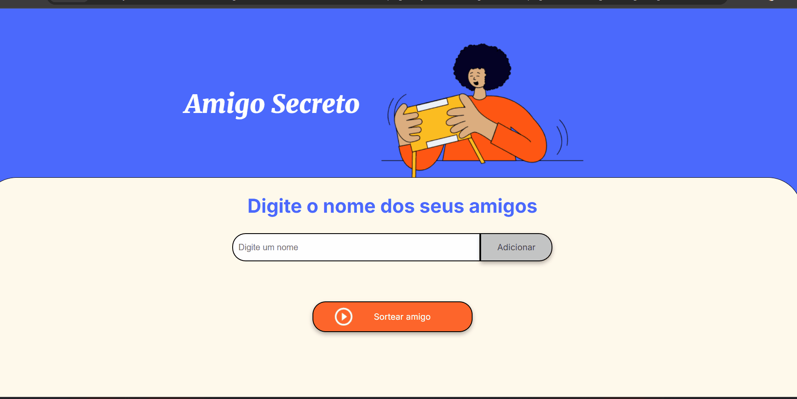

# :detective: Amigo Secreto 

## :sparkles: Descrição do Projeto

Esta é uma aplicação que permite aos usuários inserir nomes de amigos em uma lista para, em seguida, realizar um sorteio aleatório e determinar quem é o "amigo secreto".

O usuário deverá adicionar nomes por meio de um campo de texto e de um botão "Adicionar".

Os nomes inseridos serão exibidos em uma lista visível na página, e ao finalizar, um botão "Sortear Amigo" selecionará um dos nomes de forma aleatória, exibindo o resultado na tela.

## :hammer: Funcionalidades e Demonstração da Aplicação

* :white_check_mark: **Adicionar nomes:** Os usuários escreverão o nome de um amigo em um campo de texto e o adicionarão a uma lista visível ao clicar em "Adicionar".

* :white_check_mark:  **Validar entrada:** Se o campo de texto estiver vazio, o programa exibirá um alerta solicitando um nome válido.

* :white_check_mark: **Visualizar a lista:** Os nomes inseridos aparecerão em uma lista abaixo do campo de entrada.

* :white_check_mark: **Sorteio aleatório:** Ao clicar no botão "Sortear Amigo", um nome da lista será selecionado aleatoriamente e exibido na página.

* :white_check_mark: **Validar saída:** Se a lista de nomes estiver vazia, ao clicar no botão "Sortear Amigo", o programa exibirá um alerta informando que a lista está vazia.

Demonstração da aplicação rodando:

## :rocket: Acesso ao Projeto

O projeto [Amigo Secreto](https://amigosecreto-lemon.vercel.app/) está disponível na plataforma Vercel. Basta clicar no nome da aplicação que será redirecionado para o site.